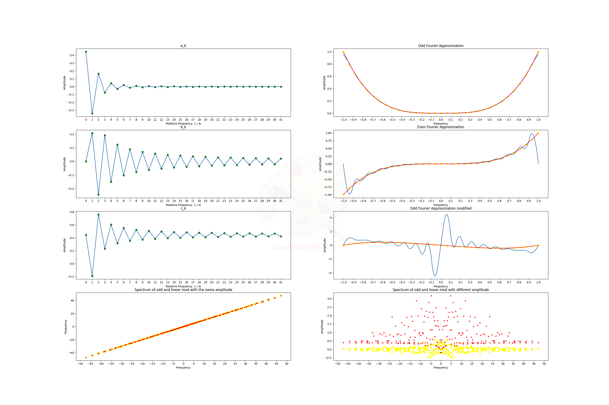

### Task:
Assume there are some function. Let's define it from 0 to 1.
First, we will reflect it in an even way. See how it converges (transform it in a Fourier series, find a_k and b_k).
Then we reflect the odd one and see how the picture has changed. For different k, and explore it.
Then modified by substract linear part and expore result.

After that let's discover how the spectrum will changed, dut to linear modification (*Hint:* in no way)
### Result:

